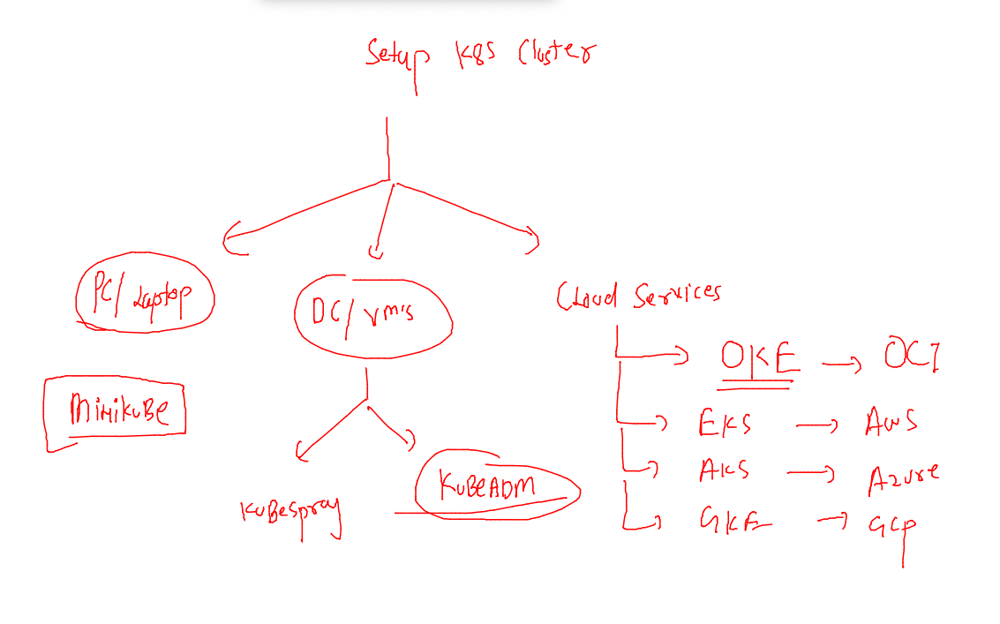
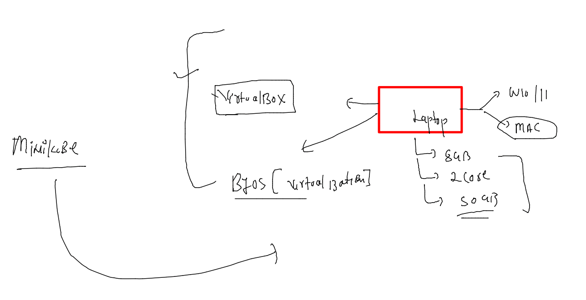
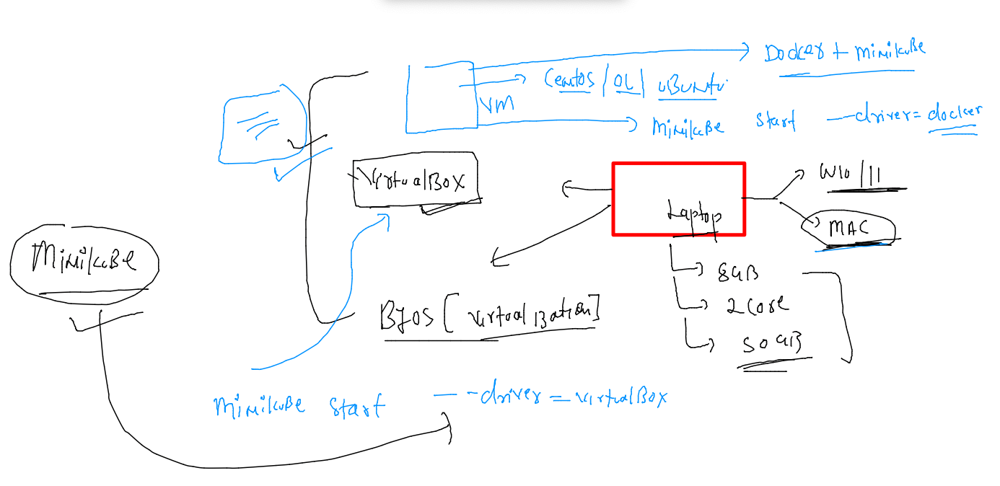

# Plan 


## setup Cluster --



## setup minikube based cluster in local pc 



### Installing on MAC 

```
curl -LO https://storage.googleapis.com/minikube/releases/latest/minikube-darwin-amd64
sudo install minikube-darwin-amd64 /usr/local/bin/minikube
```

### checking 

```
 minikube version 
minikube version: v1.25.2
commit: 362d5fdc0a3dbee389b3d3f1034e8023e72bd3a7
```

### start mac 



