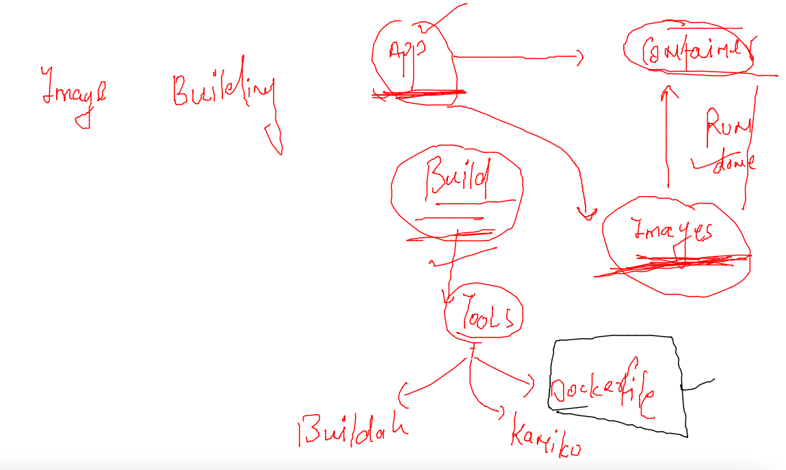
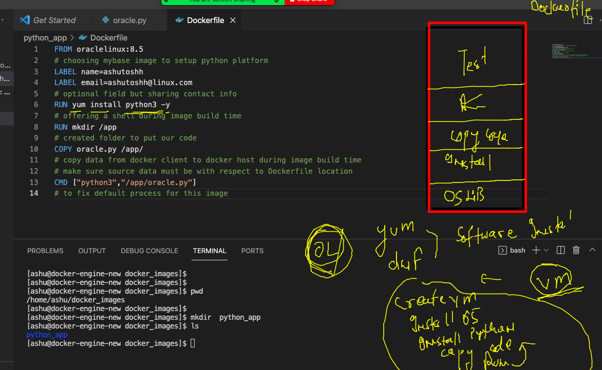

# Plan 


## image building 



### Dockerfile 1 



### building image 

```
[ashu@docker-engine-new docker_images]$ ls
python_app
[ashu@docker-engine-new docker_images]$ cd  python_app/
[ashu@docker-engine-new python_app]$ ls
Dockerfile  oracle.py
[ashu@docker-engine-new python_app]$ docker  build  -t  ashupython:appv1   .  
Sending build context to Docker daemon  3.584kB
Step 1/7 : FROM oraclelinux:8.5
Trying to pull repository docker.io/library/oraclelinux ... 
8.5: Pulling from docker.io/library/oraclelinux
ddbf5527cdbf: Pull complete 
Digest: sha256:521773838976a9b1876e609ce5c90b9ddd54f5d506c4aba9bfcd0b6e9b21eb61
Status: Downloaded newer image for oraclelinux:8.5
 ---> 33cf63d32184
Step 2/7 : LABEL name=ashutoshh
 ---> Running in bce09db89abf
Removing intermediate container bce09db89
```

### container creation 

```
[ashu@docker-engine-new python_app]$ docker  run  -it  -d  --name  ashuc11  ashupython:appv1  
121c2c5f34e2c546e538a96496179e50c39059c3137574721c92a512677dd70b
[ashu@docker-engine-new python_app]$ docker  ps
CONTAINER ID        IMAGE                   COMMAND                  CREATED             STATUS              PORTS               NAMES
20f803b379e8        natarajanpython:appv1   "python3 /app/oracle…"   2 seconds ago       Up 1 second                             natarajan11
121c2c5f34e2        ashupython:appv1        "python3 /app/oracle…"   4 seconds ago       Up 2 seconds                            ashuc11
[ashu@docker-engine-new python_app]$ 

```

### checking output 

```
[ashu@docker-engine-new python_app]$ docker  logs  -f  ashuc11 
Hello all , welcome to python..!!
Welcome to Oracle India ..
Welcome to Containers ..!!
______________________
Hello all , welcome to python..!!
Welcome to Oracle In
```

