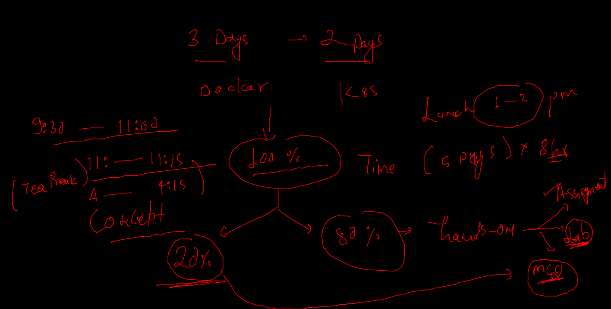
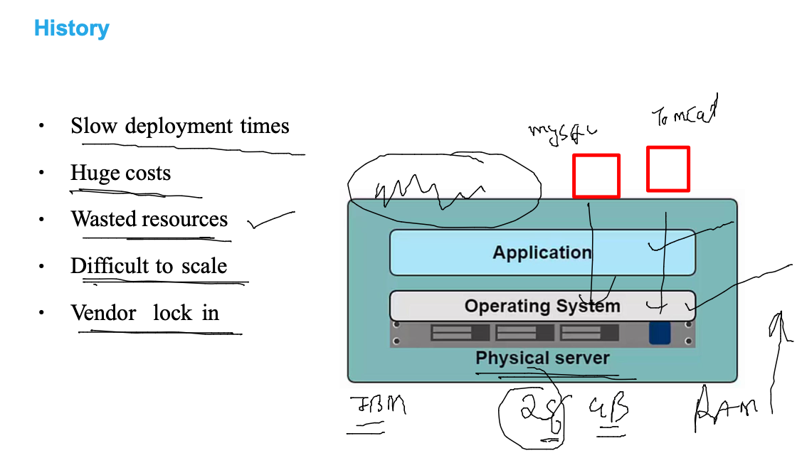
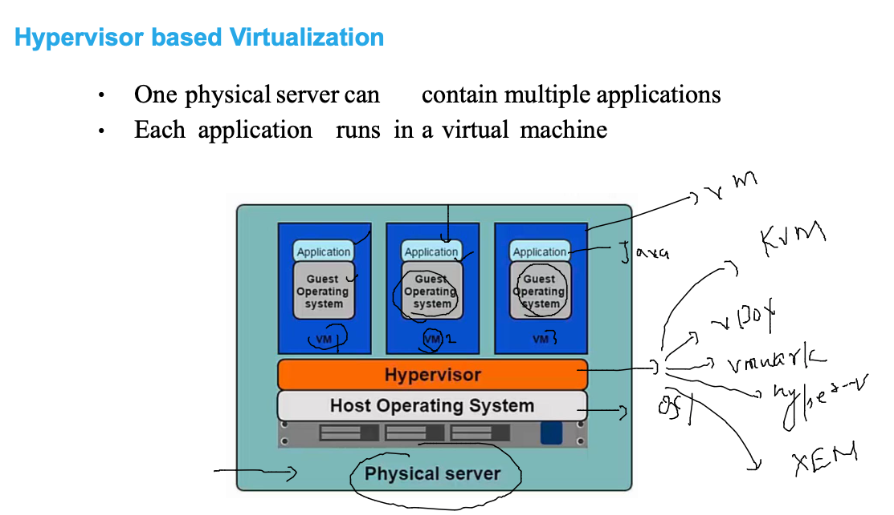
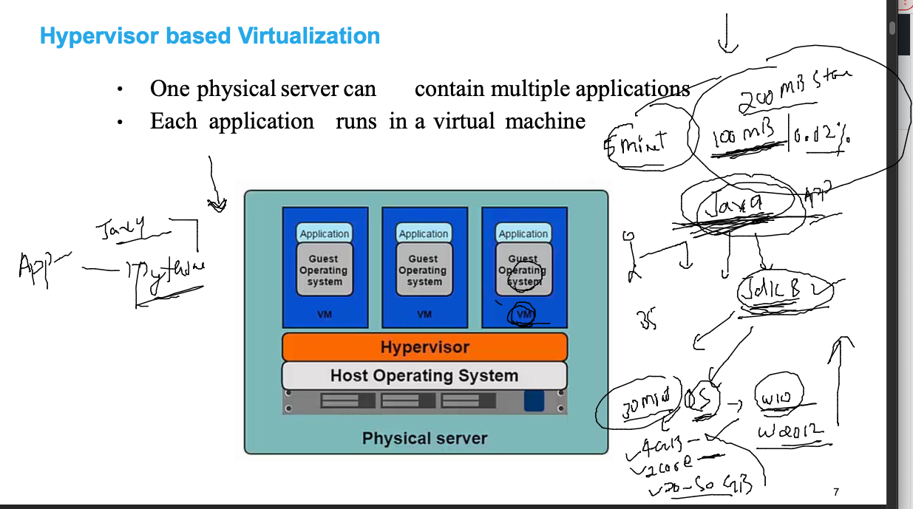
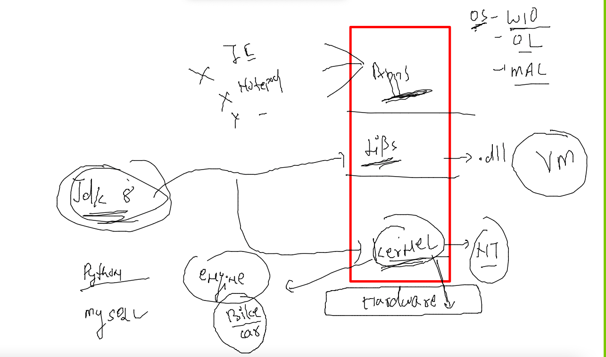
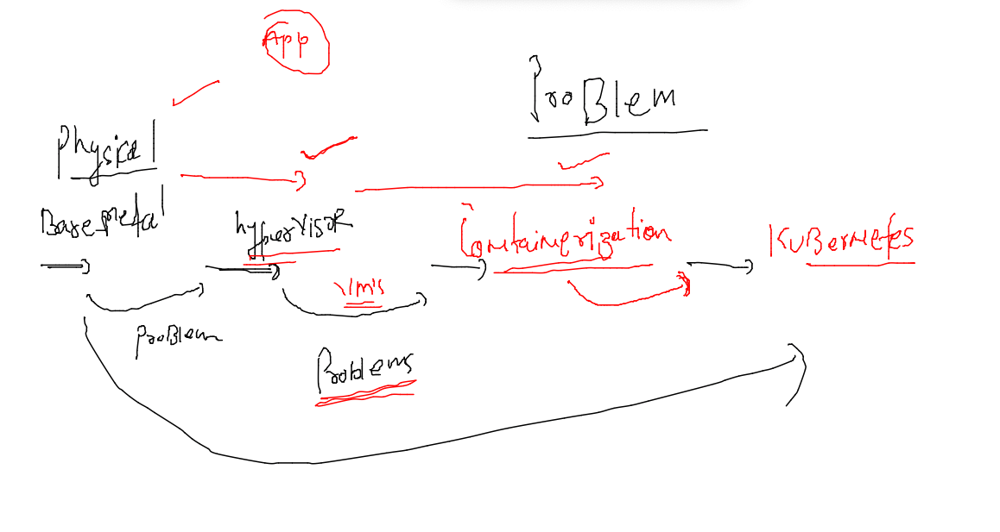
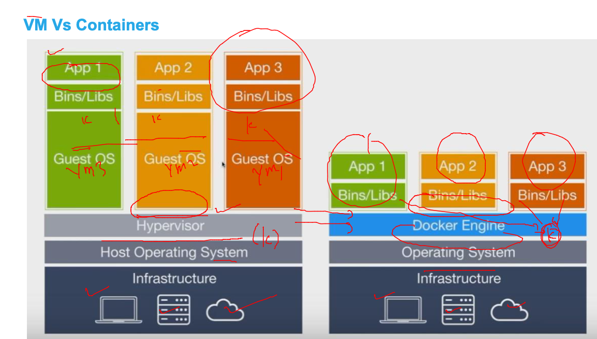
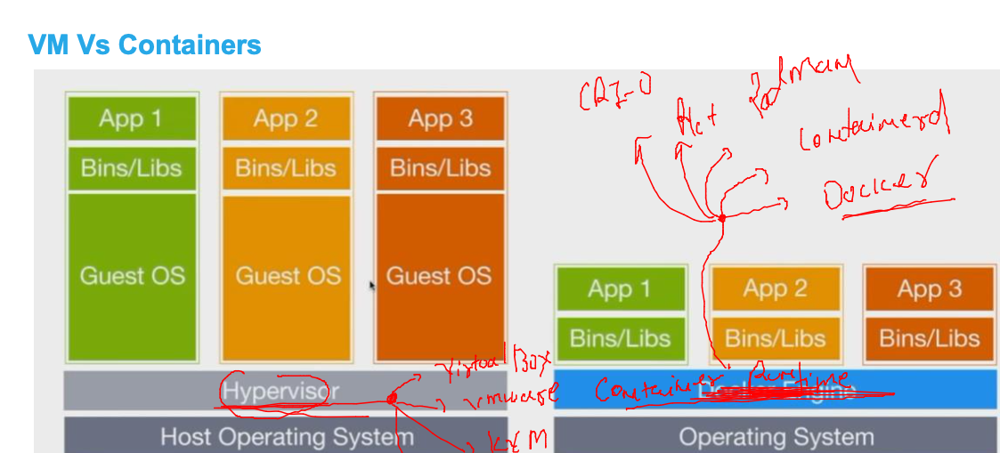
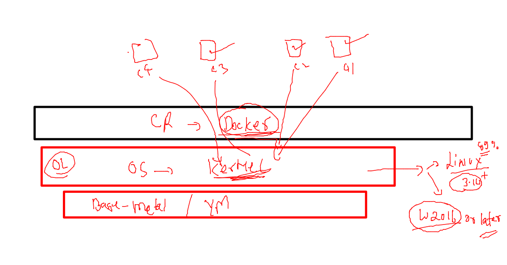
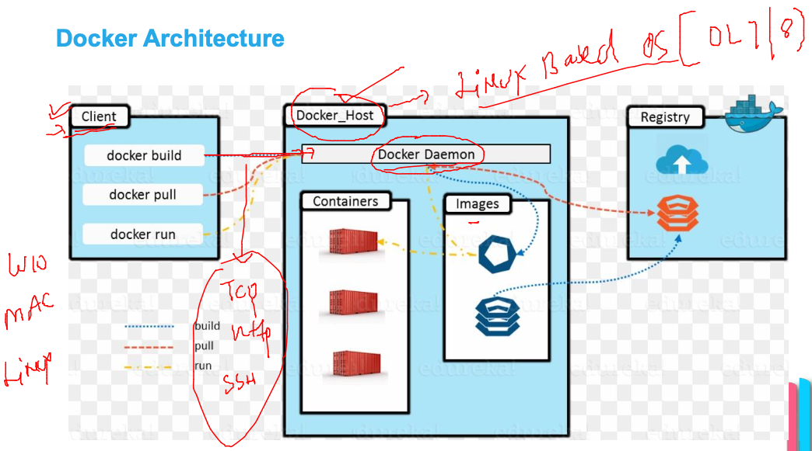

# Plan 



## app deploy  / testing problems in past 



## bare-metal to hypervisor journey 



## problem with VMs



### OS layer understanding 



### vm problem solved by COntainers 



### intro to containers  by Docker 



### Container runtime vs Hypervisor 



### only LInux and windows 2016 + based containers are possible by Docker 



### Docker architecture 



### installing docker ce in OL 7.9 

```
[root@docker-engine ~]# yum   install docker  -y
Failed to set locale, defaulting to C
Loaded plugins: langpacks, ulninfo
ol7_MySQL80                                                                                | 3.0 kB  00:00:00     
ol7_MySQL80_connectors_community                                                           | 2.9 kB  00:00:00     
ol7_MySQL80_tools_community                                                                | 2.9 kB  00:00:00     
ol7_UEKR6                                                                                  | 3.0 kB  00:00:00     
ol7_addons                                                                                 | 3.0 kB  00:00:00     
ol7_ksplice                                                                                | 3.0 kB  00:00:00     
ol7_latest                   

```

### Docker ce installation link 

[link](https://docs.docker.com/engine/install/)

### start docker service in OL vm 

```
[root@docker-engine ~]# systemctl start  docker 
[root@docker-engine ~]# systemctl enable  docker 
Created symlink from /etc/systemd/system/multi-user.target.wants/docker.service to /usr/lib/systemd/system/docker.service.
[root@docker-engine ~]# 
[root@docker-engine ~]# systemctl status docker 
● docker.service - Docker Application Container Engine
   Loaded: loaded (/usr/lib/systemd/system/docker.service; enabled; vendor preset: disabled)
   Active: active (running) since Mon 2022-03-21 06:13:23 GMT; 40s ago
     Docs: https://docs.docker.com
 Main PID: 12249 (dockerd)
   CGroup: /system.slice/docker.service
           └─12249 /usr/bin/dockerd -H fd:// --containerd=/run/containerd/containerd.sock

```

### Docker infra team -- troubleshooting --

### non root users can't connection to docker daemon / service 

```
[ashu@docker-engine ~]$ docker  version 
Client: Docker Engine - Community
 Version:           19.03.11-ol
 API version:       1.40
 Go version:        go1.16.2
 Git commit:        9bb540d
 Built:             Fri Jul 23 01:33:55 2021
 OS/Arch:           linux/amd64
 Experimental:      false
Got permission denied while trying to connect to the Docker daemon socket at unix:///var/run/docker.sock: Get "http://%2Fvar%2Frun%2Fdocker.sock/v1.40/version": dial unix /var/run/docker.sock: connect: permission denied

```

### solution --

```
usermod -aG docker  ashu
```

### testing back 

```
[ashu@docker-engine ~]$ docker  version  
Client: Docker Engine - Community
 Version:           19.03.11-ol
 API version:       1.40
 Go version:        go1.16.2
 Git commit:        9bb540d
 Built:             Fri Jul 23 01:33:55 2021
 OS/Arch:           linux/amd64
 Experimental:      false

Server: Docker Engine - Community
 Engine:
  Version:          19.03.11-ol
  API version:      1.40 (minimum version 1.12)
  Go version:       go1.16.2
  Git commit:       9bb540d
  Built:            Fri Jul 23 01:32:08 2021
  OS/Arch:          linux/amd64
```

### overall job done by root user in OL 7.9 vm 

```
[root@docker-engine ~]# history 
    1  yum   install docker  -y
    2  systemctl start  docker 
    3  systemctl enable  docker 
    4  systemctl status docker 
    5  for  i in   ashu deevena dwarka mahesh mari  natarajan nitin pavan sai suneel venkat pooja ; do useradd $i ; echo "Oracle098#"  |  passwd $i --stdin ; done 
    6  vim /etc/ssh/sshd_config 
    7  systemctl restart sshd
    8  history 
    9  docker  version 
   10  ls /home
   11  usermod -aG docker  ashu
   12  for  i in  `ls /home`; do usermod -aG docker $i ; done 

```

## Docker operations 

### searching image on docker hub 

```
docker  search  mysql 
INDEX               NAME                             DESCRIPTION                                     STARS               OFFICIAL            AUTOMATED
docker.io           mysql                            MySQL is a widely used, open-source relation…   12283               [OK]                
docker.io           mariadb                          MariaDB Server is a high performing open sou…   4723                [OK]                
docker.io           mysql/mysql-server               Optimized MySQL Server Docker images. Create…   911                                     [OK]
docker.io           percona                   
```

### list of images 

```
ashu@docker-engine-new ~]$ docker  images
REPOSITORY          TAG                 IMAGE ID            CREATED             SIZE
[ashu@docker-engine-new ~]$ 

```
### pulling images 

```
[ashu@docker-engine-new ~]$ docker pull  openjdk 
Using default tag: latest
Trying to pull repository docker.io/library/openjdk ... 
latest: Pulling from docker.io/library/openjdk
1824cb7e97fb: Pull complete 
7db19695be7b: Pull complete 
fc6e4d76e00b: Pull complete 
Digest: sha256:f2de674baa154219b8cf4678f941e714fcdb98904ca2bd975cac3523cfecc787
Status: Downloaded newer image for openjdk:latest
openjdk:latest
[ashu@docker-engine-new ~]$ docker  images
REPOSITORY          TAG                 IMAGE ID            CREATED             SIZE
openjdk             latest              1ffbb31e1412        45 hours ago        471MB
[ashu@docker-engine-new ~]$ 

```


### creating first container 
```
[ashu@docker-engine-new ~]$ docker  run  --name  ashuc1  -d  oraclelinux:8.4     sleep 100  
49af9cb2e600df240f6d97bef851934fed849d7e2e3dd02965a097f7dab40862
[ashu@docker-engine-new ~]$ docker  ps
CONTAINER ID        IMAGE               COMMAND             CREATED             STATUS              PORTS               NAMES
49af9cb2e600        oraclelinux:8.4     "sleep 100"         3 seconds ago       Up 2 seconds                            ashuc1
[ashu@docker-engine-new ~]$ 

```

### list of running containers 

```
[ashu@docker-engine-new ~]$ docker  ps
CONTAINER ID        IMAGE               COMMAND                  CREATED              STATUS              PORTS               NAMES
1a88671bfc08        oraclelinux:8.4     "sleep 100"              5 seconds ago        Up 4 seconds                            mari
ac549a565421        oraclelinux:8.4     "sleep 100"              13 seconds ago       Up 13 seconds                           pavan1
e8b9eeba59c6        oraclelinux:8.4     "sleep 100"    

```

### list of all containers 

```
[ashu@docker-engine-new ~]$ docker  ps  -a
CONTAINER ID        IMAGE               COMMAND             CREATED              STATUS                          PORTS               NAMES
ad217600fd2e        oraclelinux:8.4     "ping google.com"   13 seconds ago       Up 12 seconds                                       poojac1
85206068eff1        oraclelinux:8.4     "ping google.com"   About a minute ago   Up 59 seconds                                       suneel2
180443b1a98a        oraclelinux:8.4     "ping google.com"   About a minute ago   Up About a minute                                   dwarka1
e019529a3609        oraclelinux:8.4     "ping google.com"   About a minute ago   Exited (0) About a minute ago                       suneel1
b9faa4c65e50        oraclelinux:8.4     "ping google.com"   2 minutes ago        Up 2 minutes                                        Pragnya
b56a4ab96ab7        oraclelinux:8.4     "ping g
```

### checking resources of container

```
[ashu@docker-engine-new ~]$ 
[ashu@docker-engine-new ~]$ docker  stats  ashuc1  


CONTAINER ID        NAME                CPU %               MEM USAGE / LIMIT   MEM %               NET I/O             BLOCK I/O           PIDS
45b9263dfb51        ashuc1              0.01%               812KiB / 15.35GiB   0.01%               34.6kB / 32.9kB     0B / 0B             1
^C
[ashu@docker-engine-new ~]$ 


```

### checking output of container parent process

```
 48  docker  logs  ashuc1  
   49  docker  logs  -f  ashuc1  

```

### running child process --

```
[ashu@docker-engine-new ~]$ docker  exec  ashuc1   ls  /
bin
boot
dev
etc
home
lib
lib64
media
mnt
opt
proc
root
run
sbin
srv
sys
tmp
usr
var
[ashu@docker-engine-new ~]$ docker  exec  ashuc1  uname -r
5.4.17-2136.304.4.1.el7uek.x86_64
[ashu@docker-engine-new ~]$ 
[ashu@docker-engine-new ~]$ 
[ashu@docker-engine-new ~]$ 
[ashu@docker-engine-new ~]$ uname  -r
5.4.17-2136.304.4.1.el7uek.x86_64


```

### access container shell 

```
[ashu@docker-engine-new ~]$ docker  exec  -it   ashuc1   bash 
[root@45b9263dfb51 /]# 
[root@45b9263dfb51 /]# 
[root@45b9263dfb51 /]# uname -r
5.4.17-2136.304.4.1.el7uek.x86_64
[root@45b9263dfb51 /]# cat  /etc/os-release 
NAME="Oracle Linux Server"
VERSION="8.4"
ID="ol"
ID_LIKE="fedora"
VARIANT="Server"
VARIANT_ID="server"
VERSION_ID="8.4"
PLATFORM_ID="platform:el8"
PRETTY_NAME="Oracle Linux Server 8.4"
ANSI_COLOR="0;31"
CPE_NAME="cpe:/o:oracle:linux:8:4:server"
HOME_URL="https://linux.oracle.com/"
BUG_REPORT_URL="https://bugzilla.oracle.com/"

ORACLE_BUGZILLA_PRODUCT="Oracle Linux 8"
ORACLE_BUGZILLA_PRODUCT_VERSION=8.4
ORACLE_SUPPORT_PRODUCT="Oracle Linux"
ORACLE_SUPPORT_PRODUCT_VERSION=8.4
[root@45b9263dfb51 /]# ls  /
bin  boot  dev  etc  home  lib  lib64  media  mnt  opt  proc  root  run  sbin  srv  sys  tmp  usr  var
[root@45b9263dfb51 /]# exit
exit


```

### stopping container 

```
[ashu@docker-engine-new ~]$ docker  stop  ashuc1
ashuc1
[ashu@docker-engin
```

### start container 

```
docker  start  ashuc1
ashuc1

```

### restart container 

```
 docker  restart  ashuc1
ashuc1

```

### stop vs kill  -- and remove 

```
[ashu@docker-engine-new ~]$ docker  stop  ashuc1  
ashuc1
[ashu@docker-engine-new ~]$ docker  start  ashuc1  
ashuc1
[ashu@docker-engine-new ~]$ 
[ashu@docker-engine-new ~]$ docker  kill   ashuc1  
ashuc1
[ashu@docker-engine-new ~]$ docker  start  ashuc1  
ashuc1
[ashu@docker-engine-new ~]$ docker  kill   ashuc1  
ashuc1
[ashu@docker-engine-new ~]$ docker  rm  ashuc1
ashuc1
[ashu@docker-engine-new ~]$ 
```

## tips --- 

### operations with selected containers

```
[ashu@docker-engine-new ~]$ docker  ps
CONTAINER ID        IMAGE               COMMAND             CREATED             STATUS              PORTS               NAMES
514e450cd2c8        oraclelinux:8.4     "/bin/bash"         22 minutes ago      Up 22 minutes                           ashuc2
ad217600fd2e        oraclelinux:8.4     "ping google.com"   36 minutes ago      Up 36 minutes                           poojac1
180443b1a98a        oraclelinux:8.4     "ping google.com"   37 minutes ago      Up 37 minutes                           dwarka1
b9faa4c65e50        oraclelinux:8.4     "ping google.com"   37 minutes ago      Up 37 minutes                           Pragnya
b378a72db0b2        oraclelinux:8.4     "ping google.com"   38 minutes ago      Up 38 minutes                           deevena
480f5cdffb10        oraclelinux:8.4     "ping google.com"   39 minutes ago      Up 39 minutes                           nithin1
f7efdf7560ed        oraclelinux:8.4     "ping google.com"   39 minutes ago      Up 8 minutes                            pavanc1
2098dd4ddfa7        oraclelinux:8.4     "ping google.com"   39 minutes ago      Up 7 minutes                            ashishc1
[ashu@docker-engine-new ~]$ docker  kill   ashishc1  deevena  514e450cd2c8 
ashishc1
deevena
514e450cd2c8
[ashu@docker-engine-new ~]$ docker  ps
CONTAINER ID        IMAGE               COMMAND             CREATED             STATUS              PORTS               NAMES
ad217600fd2e        oraclelinux:8.4     "ping google.com"   36 minutes ago      Up 36 minutes                           poojac1
85206068eff1        oraclelinux:8.4     "ping google.com"   37 minutes ago      Up 19 seconds                           suneel2
180443b1a98a        oraclelinux:8.4     "ping google.com"   38 minutes ago      Up 38 minutes                           dwarka1
b9faa4c65e50        oraclelinux:8.4     "ping google.com"   38 minutes ago      Up 38 minutes                           Pragnya
480f5cdffb10        oraclelinux:8.4     "ping google.com"   39 minutes ago      Up 39 minutes                           nithin1
f7efdf7560ed        oraclelinux:8.4     "ping google.com"   39 minutes ago      Up 8 minutes                            pavanc1
[ashu@docker-engine-new ~]$ docker  start   ashishc1  deevena  514e450cd2c8 
ashishc1
deevena
514e450cd2c8
[ashu@docker-engine-new ~]$ docker ps
CONTAINER ID        IMAGE               COMMAND             CREATED             STATUS              PORTS               NAMES
514e450cd2c8        oraclelinux:8.4     "/bin/bash"         22 minutes ago      Up 3 seconds                            ashuc2
ad217600fd2e        oraclelinux:8.4     "ping google.com"   36 minutes ago      Up 36 minutes                           poojac1
85206068eff1        oraclelinux:8.4     "ping google.com"   37 minutes ago      Up 33 seconds                           suneel2
180443b1a98a        oraclelinux:8.4     "ping google.com"   38 minutes ago      Up 38 minutes                           dwarka1
b9faa4c65e50        oraclelinux:8.4     "ping google.com"   38 minutes ago      Up 38 minutes                           Pragnya
b378a72db0b2        oraclelinux:8.4     "ping google.com"   38 minutes ago      Up 3 seconds                            deevena
480f5cdffb10        oraclelinux:8.4     "ping google.com"   39 minutes ago      Up 39 minutes                           nithin1
f7efdf7560ed        oraclelinux:8.4     "ping google.com"   40 minutes ago      Up 8 minutes                            pavanc1
2098dd4ddfa7        oraclelinux:8.4     "ping google.com"   40 minutes ago      Up 4 seconds                            ashishc1
```

### with all the containers 

```
108  docker kill   $(docker  ps  -q)  
  109  docker start   $(docker  ps  -q -a)  
  110  docker kill   $(docker  ps  -q)  
  111  docker rm    $(docker  ps  -qa)  
```

