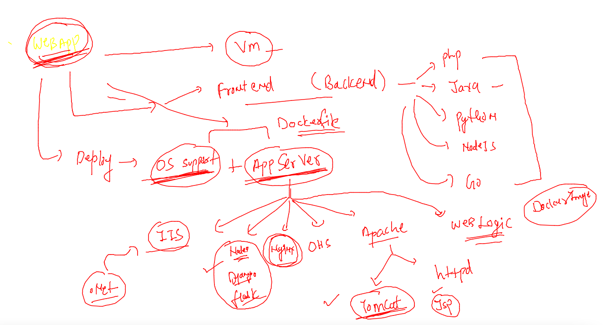
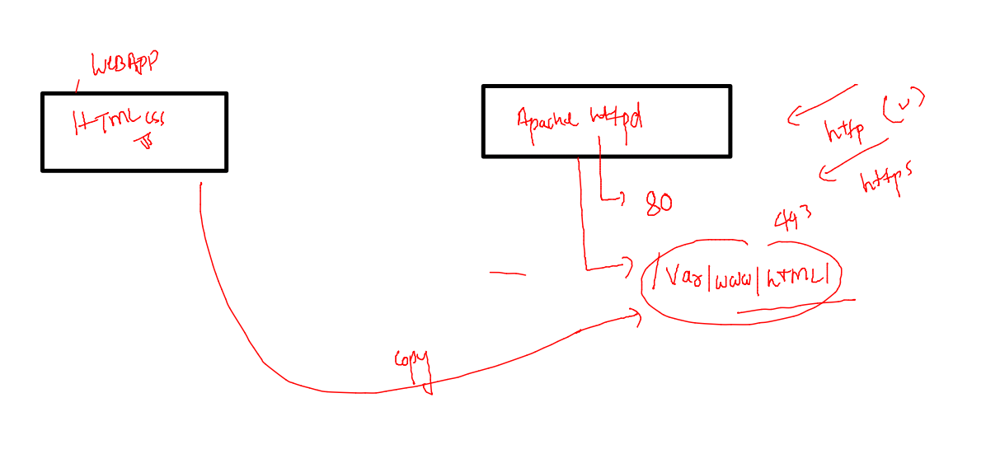
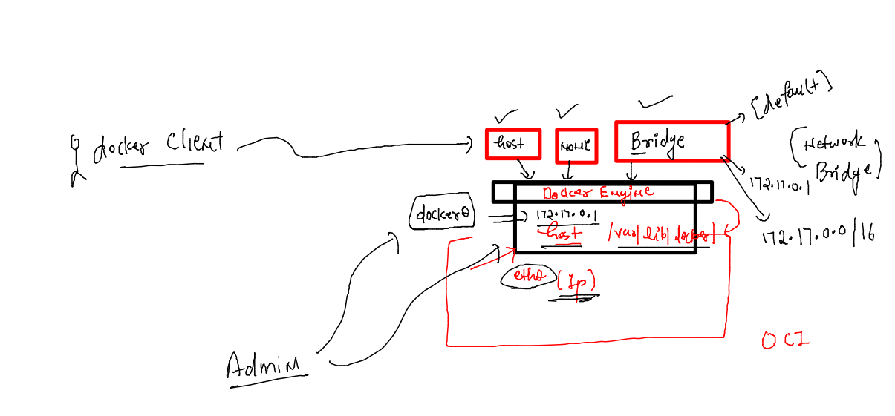
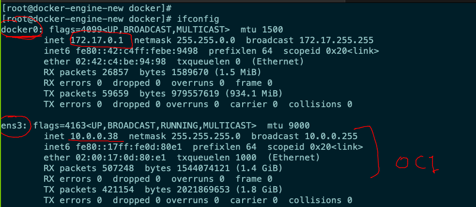
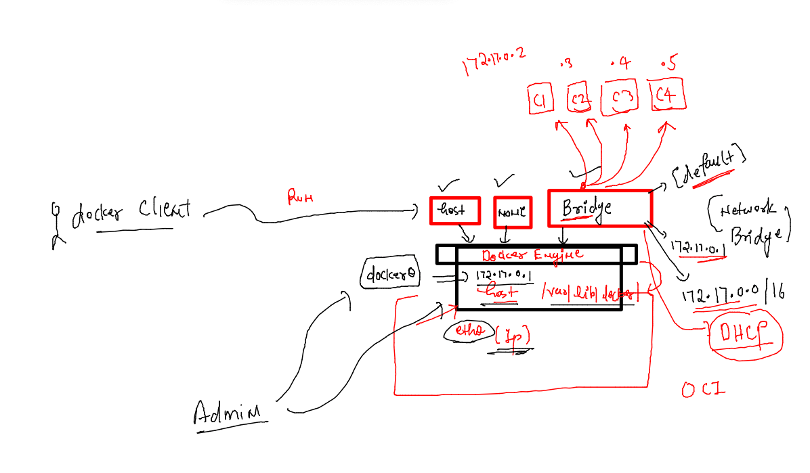
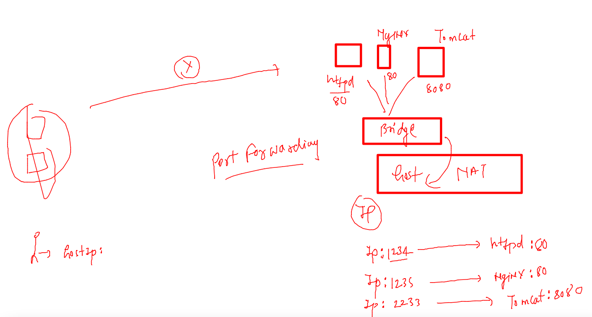
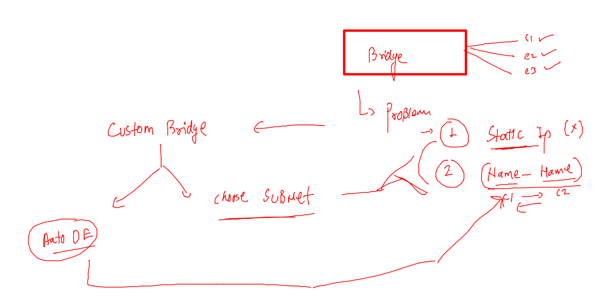

# Plan 


## Docker engine data migration 

### FRom source system 

```
rsync -avp  /var/lib/docker/    root@3.88.139.0:/var/lib/docker/

```

### at target system 

```
[root@awsdocker ~]# docker  images
REPOSITORY   TAG       IMAGE ID   CREATED   SIZE
[root@awsdocker ~]# docker  ps -a
CONTAINER ID   IMAGE     COMMAND   CREATED   STATUS    PORTS     NAMES
[root@awsdocker ~]# 
[root@awsdocker ~]# systemctl restart  docker 
[root@awsdocker ~]# docker  ps -a
CONTAINER ID   IMAGE          COMMAND     CREATED          STATUS                     PORTS     NAMES
3d9583c1e016   e9adb5357e84   "/bin/sh"   33 minutes ago   Exited (0) 3 seconds ago             c1
[root@awsdocker ~]# docker images
REPOSITORY                     TAG        IMAGE ID       CREATED        SIZE
test                           v3         c857503b33d1   18 hours ago   5.57MB
<none>                         <none>     0027e8002982   18 hours ago   5.57MB
<none>                         <none>     ee43ba046f6e   18 hours ago   5.57MB
test                           v2         889781b07b99   18 hours ago   5.57MB
test                           v1         3ed7ecb78ccc   18 hours ago   5.57MB
poojaalp                       pycodev2   2cf6d87205d1   18 hours ago   54MB
poojaoracledockerid/poojaalp   pycodev2   2cf6d87205d1   18 hours ago   54MB
poojacimg                      v007       7331a74ea55c   18 hours ago   452MB
pavancimg                      v007       a2a772db271b   19 hours ago   452MB
ashucmig                       v007       1cba1484fcf7   19 hours ago   452MB
alpine                         latest     e9adb5357e84   6 days ago     5.57MB
busybox                        latest     2fb6fc2d97e1   11 days ago    1.24MB
centos                         centos7    eeb6ee3f44bd   6 months ago   204MB

```

## Docker container restart policy 

[docs](https://docs.docker.com/config/containers/start-containers-automatically/)

```
docker run -itd --name c3  --restart always alpine 
```

## Webapps in a container 

### app servers 



### sample webapp with apache httpd server 



## Docker networking 

### setup 1



### checking network bridge details as docker client 

```
[ashu@docker-engine-new webapp]$ docker  network   ls
NETWORK ID          NAME                DRIVER              SCOPE
653848cd21ea        bridge              bridge              local
79e79a3c217c        host                host                local
f753c4f2115d        none                null                local
[ashu@docker-engine-new webapp]$ 

```

### checking bridge details from docker client 

```
[ashu@docker-engine-new webapp]$ docker  network   inspect  bridge 
[
    {
        "Name": "bridge",
        "Id": "653848cd21eafb4126b93757282b93d157a949ccde319cfef86d0edac5a00dc4",
        "Created": "2022-03-23T05:06:15.603691969Z",
        "Scope": "local",
        "Driver": "bridge",
        "EnableIPv6": false,
        "IPAM": {
            "Driver": "default",
            "Options": null,
            "Config": [
                {
                    "Subnet": "172.17.0.0/16",
                    "Gateway": "172.17.0.1"
                }
            ]
        },
```

### check NIC from linux admin as root user 



### IP address allocation to containers using bridge 



### docker json format 

```
418  docker  inspect  ashuc1  --format='{{.Id}}'
  419  docker  inspect  ashuc1  --format='{{.State.Status}}'
  420  docker  inspect  ashuc1  --format='{{.NetworkSettings.IPAddress}}'
  421  docker  ps
  422  docker  inspect  pragnyac1  --format='{{.NetworkSettings.IPAddress}}'
```

### checking network from inside container 

```
[ashu@docker-engine-new webapp]$ docker  exec  -it  ashuc1  sh 
/ # ifconfig 
eth0      Link encap:Ethernet  HWaddr 02:42:AC:11:00:02  
          inet addr:172.17.0.2  Bcast:172.17.255.255  Mask:255.255.0.0
          UP BROADCAST RUNNING MULTICAST  MTU:1500  Metric:1
          RX packets:14 errors:0 dropped:0 overruns:0 frame:0
          TX packets:0 errors:0 dropped:0 overruns:0 carrier:0
          collisions:0 txqueuelen:0 
          RX bytes:1156 (1.1 KiB)  TX bytes:0 (0.0 B)

lo        Link encap:Local Loopback  
          inet addr:127.0.0.1  Mask:255.0.0.0
          UP LOOPBACK RUNNING  MTU:65536  Metric:1
          RX packets:0 errors:0 dropped:0 overruns:0 frame:0
          TX packets:0 errors:0 dropped:0 overruns:0 carrier:0
          collisions:0 txqueuelen:1000 
          RX bytes:0 (0.0 B)  TX bytes:0 (0.0 B)

/ # route -n
Kernel IP routing table
Destination     Gateway         Genmask         Flags Metric Ref    Use Iface
0.0.0.0         172.17.0.1      0.0.0.0         UG    0      0        0 eth0
172.17.0.0      0.0.0.0         255.255.0.0     U     0      0        0 eth0
/ # exit
```

### port forwarding 



```
docker  run  -itd  --name ashwebapp1  -p   1234:80  ashuhttpd:v1  
444c4e71f5282e4a191297de984df623b5516e98a4e598094ed78010e82d091d
[ashu@docker-engine-new webapp]$ docker  ps
CONTAINER ID        IMAGE               COMMAND                  CREATED             STATUS              PORTS                  NAMES
444c4e71f528        ashuhttpd:v1        "/bin/sh -c 'httpd -…"   19 seconds ago      Up 17 seconds       0.0.0.0:1234->80/tcp   ashwebapp1
[ashu@docker-engine-new webapp]$ 
```

### creating docker network 



### create custom brige 

```
[ashu@docker-engine-new webapp]$ docker  network  ls
NETWORK ID          NAME                DRIVER              SCOPE
653848cd21ea        bridge              bridge              local
79e79a3c217c        host                host                local
f753c4f2115d        none                null                local
[ashu@docker-engine-new webapp]$ docker  network  create  ashubr1  
4acecc8c90280206a4eeed84ee2f64ffc63addb3bf89479c114eeb86fe5feb38
[ashu@docker-engine-new webapp]$ docker  network  ls
NETWORK ID          NAME                DRIVER              SCOPE
4acecc8c9028        ashubr1             bridge              local
653848cd21ea        bridge              bridge              local
79e79a3c217c        host                host                local
f753c4f2115d        none                null                local
[ashu@docker-engine-new webapp]$ docker  network  inspect   ashubr1  
[
    {
        "Name": "ashubr1",
        "Id": "4acecc8c90280206a4eeed84ee2f64ffc63addb3bf89479c114eeb86fe5feb38",
        "Created": "2022-03-23T08:59:16.16302406Z",
        "Scope": "local",
        "Driver": "bridge",
        "EnableIPv6": false,
        "IPAM": {
            "Driver": "default",
            "Options": {},
            "Config": [
                {
                    "Subnet": "172.18.0.0/16",
                    "Gateway": "172.18.0.1"
                }
            ]
```

### bridge 

```
 docker  network  create  ashubr2  --subnet  192.168.10.0/24
```

### more demo

```
[ashu@docker-engine-new webapp]$ docker  run  -itd  --name ashuc1 --network ashubr1  alpine  
62e25e8293bcf51af5a0b79fd9be8838d3fa4540ce2fe2250c2fc77ef4bc2c35
[ashu@docker-engine-new webapp]$ docker  run  -itd  --name ashuc2 --network ashubr1  alpine  
1f742935fda3e2db9354510b22fe4c60f1694d8977bbb0d4db5b93a0892ab579
[ashu@docker-engine-new webapp]$ 
[ashu@docker-engine-new webapp]$ docker  exec -it ashuc1  sh 
/ # ping  ashuc2
PING ashuc2 (172.18.0.3): 56 data bytes
64 bytes from 172.18.0.3: seq=0 ttl=64 time=0.136 ms
64 bytes from 172.18.0.3: seq=1 ttl=64 time=0.093 ms
^C
--- ashuc2 ping statistics ---
2 packets transmitted, 2 packets received, 0% packet loss
round-trip min/avg/max = 0.093/0.114/0.136 ms
/ # exit
[ashu@docker-engine-new webapp]$ docker  run  -itd  --name ashuc3 --network ashubr2  alpine  
c25ccd919d92640c63715fa2b304cd37e56fa98560661173de31478bad36a374
[ashu@docker-engine-new webapp]$ docker  exec -it ashuc1  sh 
/ # ping  ashuc3
ping: bad address 'ashuc3'
/ # 
```

### static 

```
docker  run  -itd  --name ashuc4 --network ashubr2 --ip 192.168.10.200  alpine 
```
