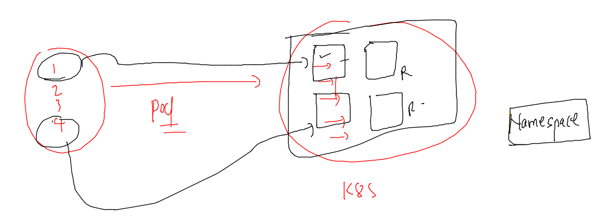

# Plan 


## setup Cluster --


## setup minikube based cluster in local pc 


### Installing on MAC 

```
curl -LO https://storage.googleapis.com/minikube/releases/latest/minikube-darwin-amd64
sudo install minikube-darwin-amd64 /usr/local/bin/minikube
```

### checking 

```
 minikube version 
minikube version: v1.25.2
commit: 362d5fdc0a3dbee389b3d3f1034e8023e72bd3a7
```

### start mac 


## Namespace in k8s



```
% kubectl  get  namespace
NAME                   STATUS   AGE
default                Active   22d
kube-node-lease        Active   22d
kube-public            Active   22d
kube-system            Active   22d
kubernetes-dashboard   Active   26h
fire@ashutoshhs-MacBook-Air k8s_deploy % kubectl  get  ns       
NAME                   STATUS   AGE
default                Active   22d
```

### creating namespace 

```
fire@ashutoshhs-MacBook-Air k8s_deploy % kubectl  create  namespace  ashu-space 
namespace/ashu-space created
fire@ashutoshhs-MacBook-Air k8s_deploy % kubectl  get ns                        
NAME                   STATUS   AGE
ashu-space             Active   4s
default                Active   22d
```
### setting default namespace 

```
 kubectl get  pods
No resources found in default namespace.
fire@ashutoshhs-MacBook-Air k8s_deploy % 
fire@ashutoshhs-MacBook-Air k8s_deploy % 
fire@ashutoshhs-MacBook-Air k8s_deploy % kubectl  config  set-context --current --namespace=ashu-space
Context "kubernetes-admin@kubernetes" modified.
fire@ashutoshhs-MacBook-Air k8s_deploy % 
fire@ashutoshhs-MacBook-Air k8s_deploy % kubectl get  pods                                            
No resources found in ashu-space namespace.
fire@ashutoshhs-MacBook-Air k8s_deploy % 
```

## Networking in k8s

### container networking 


### CNI 


p
