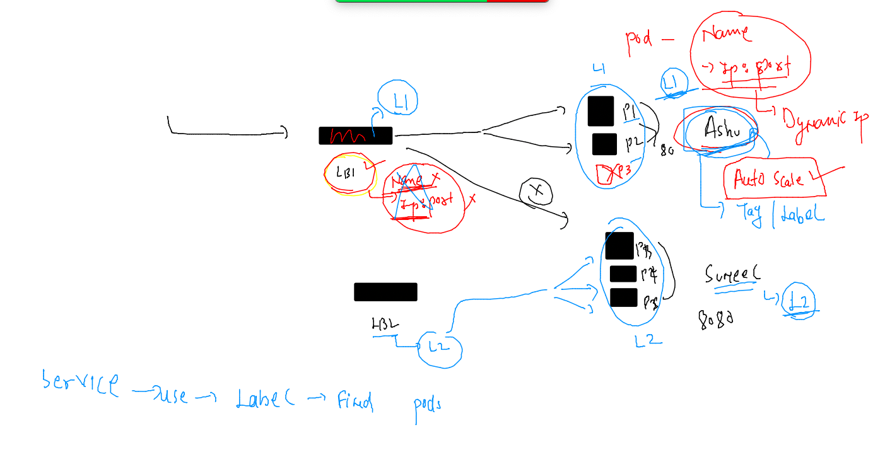

# Plan 


## setup Cluster --


## setup minikube based cluster in local pc 


### Installing on MAC 

```
curl -LO https://storage.googleapis.com/minikube/releases/latest/minikube-darwin-amd64
sudo install minikube-darwin-amd64 /usr/local/bin/minikube
```

### checking 

```
 minikube version 
minikube version: v1.25.2
commit: 362d5fdc0a3dbee389b3d3f1034e8023e72bd3a7
```

### start mac 


## Namespace in k8s


```
% kubectl  get  namespace
NAME                   STATUS   AGE
default                Active   22d
kube-node-lease        Active   22d
kube-public            Active   22d
kube-system            Active   22d
kubernetes-dashboard   Active   26h
fire@ashutoshhs-MacBook-Air k8s_deploy % kubectl  get  ns       
NAME                   STATUS   AGE
default                Active   22d
```

### creating namespace 

```
fire@ashutoshhs-MacBook-Air k8s_deploy % kubectl  create  namespace  ashu-space 
namespace/ashu-space created
fire@ashutoshhs-MacBook-Air k8s_deploy % kubectl  get ns                        
NAME                   STATUS   AGE
ashu-space             Active   4s
default                Active   22d
```
### setting default namespace 

```
 kubectl get  pods
No resources found in default namespace.
fire@ashutoshhs-MacBook-Air k8s_deploy % 
fire@ashutoshhs-MacBook-Air k8s_deploy % 
fire@ashutoshhs-MacBook-Air k8s_deploy % kubectl  config  set-context --current --namespace=ashu-space
Context "kubernetes-admin@kubernetes" modified.
fire@ashutoshhs-MacBook-Air k8s_deploy % 
fire@ashutoshhs-MacBook-Air k8s_deploy % kubectl get  pods                                            
No resources found in ashu-space namespace.
fire@ashutoshhs-MacBook-Air k8s_deploy % 
```

## Networking in k8s

### container networking 


### CNI 


## Intro to k8s internal LB using -- 


## service use label to find Pod 



### service type 


## Nodeport service in k8s


## Implement pod and Nodeport service 

### create pod 
```
kubectl  run  ashuwebapp  --image=dockerashu/ashuhttpd:v1  --port 80 --dry-run=client -o yaml       >webapp.yaml 

```

### Deploy pod 


### create service 

```
 kubectl  create  service  
Create a service using a specified subcommand.

Aliases:
service, svc

Available Commands:
  clusterip    Create a ClusterIP service
  externalname Create an ExternalName service
  loadbalancer Create a LoadBalancer service
  nodeport     Create a NodePort service
```

### 

```
kubectl  create  service   nodeport  ashusvc1  --tcp  1234:80  --dry-run=client -o yaml 
apiVersion: v1
kind: Service
metadata:
  creationTimestamp: null
  labels:
    app: ashusvc1
  name: ashusvc1
spec:
  ports:
  - name: 1234-80
    port: 1234
    protocol: TCP
    targetPort: 80
  selector:
    app: ashusvc1
  type: NodePort
status:
  loadBalancer: {}
fire@ashutoshhs-MacBook-Air k8s_deploy % kubectl  create  service   nodeport  ashusvc1  --tcp  1234:80  --dry-run=client -o yaml >websvc.yaml
fire@ashutoshhs-MacBook-Air k8s_deploy % 
```
### mathching selector 


### deploy service 

```
fire@ashutoshhs-MacBook-Air k8s_deploy % kubectl apply  -f  websvc.yaml 
service/ashusvc1 created
fire@ashutoshhs-MacBook-Air k8s_deploy % kubectl  get service 
NAME       TYPE       CLUSTER-IP     EXTERNAL-IP   PORT(S)          AGE
ashusvc1   NodePort   10.110.64.63   <none>        1234:30851/TCP   14s
fire@ashutoshhs-MacBook-Air k8s_deploy % 

```

