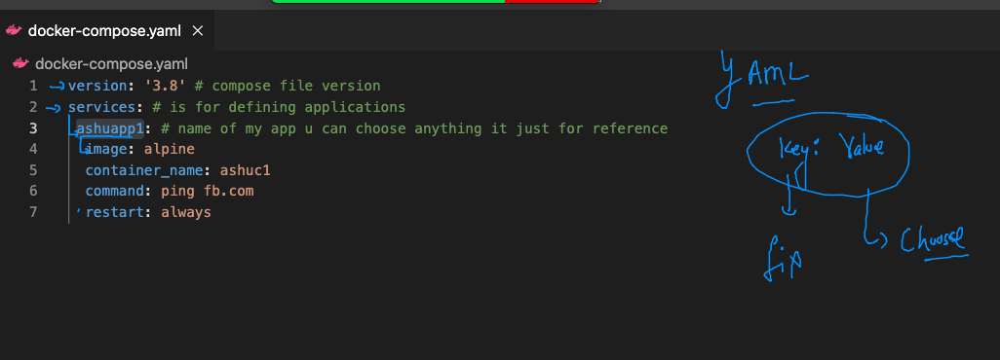
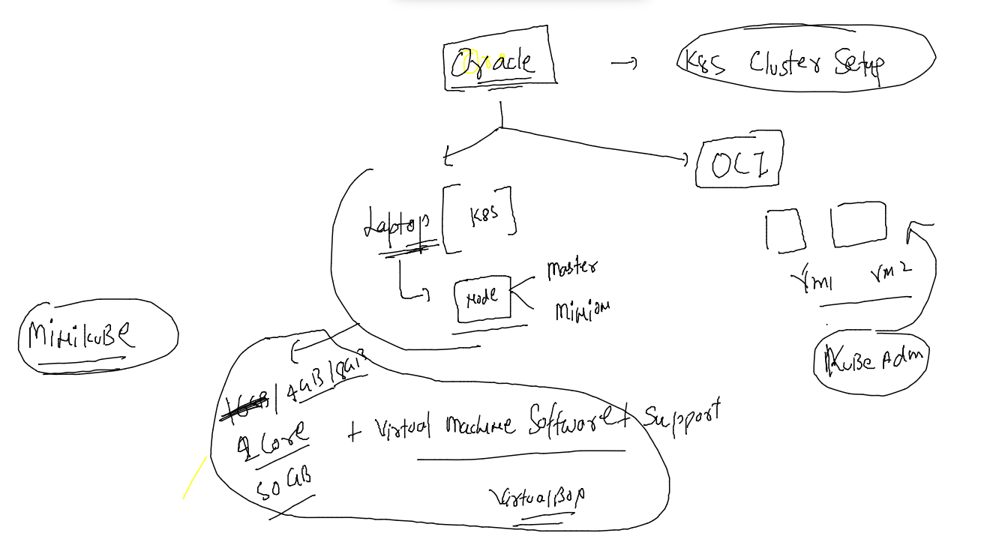

# Plan 


## Docker compose to automate container process 


### compose installation link and verification 

[compose link](https://docs.docker.com/compose/install/)

## verification 

```
docker-compose  -v 
docker-compose version 1.29.2, build 5becea4c
```

### compose file 1 



### running compsoe file 

```
[ashu@docker-engine-new docker_images]$ ls
docker-compose.yaml  Dockerfile  java_app  python_app  webapp
[ashu@docker-engine-new docker_images]$ docker-compose up  -d 
Creating network "docker_images_default" with the default driver
Pulling ashuapp1 (alpine:)...
Trying to pull repository docker.io/library/alpine ... 
latest: Pulling from docker.io/library/alpine
3aa4d0bbde19: Pull complete
Digest: sha256:ceeae2849a425ef1a7e591d8288f1a58cdf1f4e8d9da7510e29ea829e61cf512
Status: Downloaded newer image for alpine:latest
Creating ashuc1 ... done
```

### some more compose commands 

### list containers

```
 docker-compose ps
 Name      Command     State   Ports
------------------------------------
ashuc1   ping fb.com   Up           
```

### 

```
ashu@docker-engine-new ashucompose]$ docker-compose kill 
Killing ashuc1 ... done
[ashu@docker-engine-new ashucompose]$ docker-compose  ps
 Name      Command      State     Ports
---------------------------------------
ashuc1   ping fb.com   Exit 137        
[ashu@docker-engine-new ashucompose]$ docker-compose  start
Starting ashuapp1 ... done
[ashu@docker-engine-new ashucompose]$ docker-compose  ps
 Name      Command     State   Ports
------------------------------------
ashuc1   ping fb.com   Up           
```

### all clean up 

```
 docker-compose  down 
Stopping ashuc1 ... done
Removing ashuc1 ... done
Removing network ashucompose_default
```

### compose file with differnet

```
ashu@docker-engine-new ashucompose]$ docker-compose -f ashu.yaml up  -d
Creating network "ashucompose_default" with the default driver
Creating volume "ashucompose_ashudbvol1" with default driver
Pulling ashuapp2 (nginx:)...
Trying to pull repository docker.io/library/nginx ... 
latest: Pulling from docker.io/library/nginx
ae13dd578326: Pull complete
6c0ee9353e13: Pull complete
dca7733b187e: Pull complete
352e5a6cac26: Pull complete
9eaf108767c7: Pull complete
be0c016df0be: Pull complete
Digest: sha256:4ed64c2e0857ad21c38b98345ebb5edb01791a0a10b0e9e3d9ddde185cdbd31a
Status: Image is up to date for nginx:latest
Creating ashuc1   ... done
Creating ashuc22  ... done
Creating ashudbc1 ... done
[ashu@docker-engine-new ashucompose]$ docker-compose -f ashu.yaml  ps
  Name                Command               State          Ports        
------------------------------------------------------------------------
ashuc1     ping fb.com                      Up                          
ashuc22    /docker-entrypoint.sh ngin ...   Up      0.0.0.0:1144->80/tcp
ashudbc1   docker-entrypoint.sh mysqld      Up      3306/tcp, 33060/tcp 
```

### more compsoe examples 

[compose examples](https://github.com/redashu/docker-compose)

### portainer webui

```
docker  run -itd --name webui -p 9000:9000 -v /var/run/docker.sock:/var/run/docker.sock --restart always portainer/portainer
```

### problem with any container runtime 


### solution to above problem 


## Intro to k8s


### master node components 


### k8s cluster setup methods / software 



### k8s client installation 

### FOr mac 

```
fire@ashutoshhs-MacBook-Air ~ % curl -LO "https://dl.k8s.io/release/$(curl -L -s https://dl.k8s.io/release/stable.txt)/bin/darwin/amd64/kubectl"
  % Total    % Received % Xferd  Average Speed   Time    Time     Time  Current
                                 Dload  Upload   Total   Spent    Left  Speed
100   154  100   154    0     0    413      0 --:--:-- --:--:-- --:--:--   412
100 50.6M  100 50.6M    0     0  6141k      0  0:00:08  0:00:08 --:--:-- 7763k
fire@ashutoshhs-MacBook-Air ~ % chmod +x ./kubectl
fire@ashutoshhs-MacBook-Air ~ % sudo mv ./kubectl /usr/local/bin/kubectl
Password:
fire@ashutoshhs-MacBook-Air ~ % 
fire@ashutoshhs-MacBook-Air ~ % kubectl version --client 
Client Version: version.Info{Major:"1", Minor:"23", GitVersion:"v1.23.5", GitCommit:"c285e781331a3785a7f436042c65c5641ce8a9e9", GitTreeState:"clean", BuildDate:"2022-03-16T15:58:47Z", GoVersion:"go1.17.8", Compiler:"gc", Platform:"darwin/amd64"}
fire@ashutoshhs-MacBook-Air ~ % 

```
### checking client to master connection 

```
kubectl  version  --kubeconfig  admin.conf.txt 
Client Version: version.Info{Major:"1", Minor:"23", GitVersion:"v1.23.5", GitCommit:"c285e781331a3785a7f436042c65c5641ce8a9e9", GitTreeState:"clean", BuildDate:"2022-03-16T15:58:47Z", GoVersion:"go1.17.8", Compiler:"gc", Platform:"darwin/amd64"}
Server Version: version.Info{Major:"1", Minor:"23", GitVersion:"v1.23.4", GitCommit:"e6c093d87ea4cbb530a7b2ae91e54c0842d8308a", GitTreeState:"clean", BuildDate:"2022-02-16T12:32:02Z", GoVersion:"go1.17.7", Compiler:"gc", Platform:"linux/amd64"}
fire@ashutoshhs-MacBook-Air Desktop % 
fire@ashutoshhs-MacBook-Air Desktop % 
fire@ashutoshhs-MacBook-Air Desktop % kubectl  cluster-info   --kubeconfig  admin.conf.txt 
Kubernetes control plane is running at https://3.233.160.167:6443
CoreDNS is running at https://3.233.160.167:6443/api/v1/namespaces/kube-system/services/kube-dns:dns/proxy

To further debug and diagnose cluster problems, use 'kubectl cluster-info dump'.
```

### copy auth file .kube folder 

 ```
 fire@ashutoshhs-MacBook-Air Desktop % cp   admin.conf.txt  ~/.kube/config  
fire@ashutoshhs-MacBook-Air Desktop % 
fire@ashutoshhs-MacBook-Air Desktop % kubectl  cluster-info 
Kubernetes control plane is running at https://3.233.160.167:6443
CoreDNS is running at https://3.233.160.167:6443/api/v1/namespaces/kube-system/services/kube-dns:dns/proxy

To further debug and diagnose cluster problems, use 'kubectl cluster-info dump'.
fire@ashutoshhs-MacBook-Air Desktop % 


 ```
 
 ### checking nodes 
 
 ```
  kubectl  get  nodes   
NAME                            STATUS   ROLES                  AGE     VERSION
ip-172-31-29-225.ec2.internal   Ready    <none>                 4h46m   v1.23.5
ip-172-31-85-52.ec2.internal    Ready    <none>                 21d     v1.23.4
ip-172-31-90-99.ec2.internal    Ready    control-plane,master   21d     v1.23.4
fire@ashutoshhs-MacBook-Air Desktop % 


 ```
