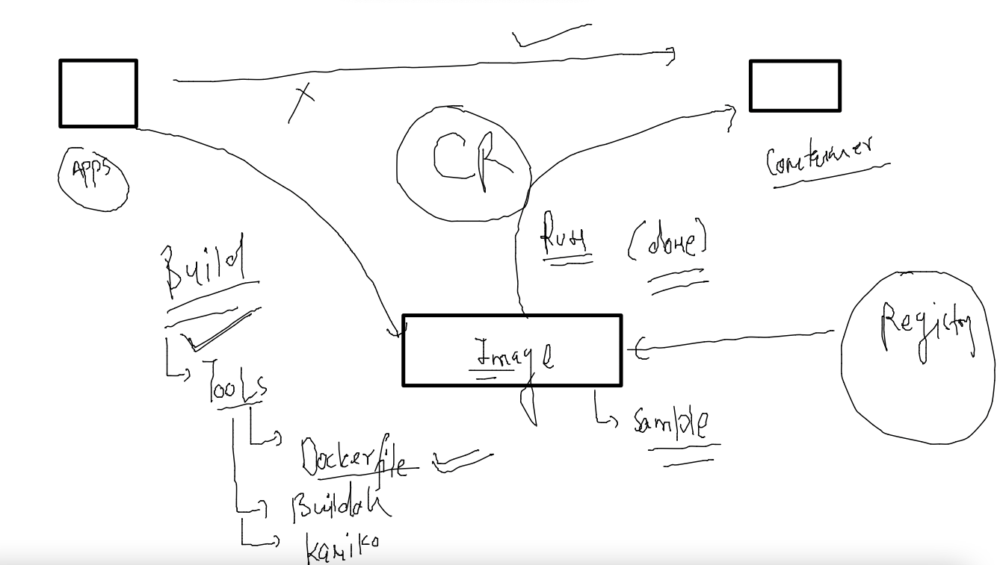

# Plan 


## image building 



### Dockerfile 1 


### building image 

```
[ashu@docker-engine-new docker_images]$ ls
python_app
[ashu@docker-engine-new docker_images]$ cd  python_app/
[ashu@docker-engine-new python_app]$ ls
Dockerfile  oracle.py
[ashu@docker-engine-new python_app]$ docker  build  -t  ashupython:appv1   .  
Sending build context to Docker daemon  3.584kB
Step 1/7 : FROM oraclelinux:8.5
Trying to pull repository docker.io/library/oraclelinux ... 
8.5: Pulling from docker.io/library/oraclelinux
ddbf5527cdbf: Pull complete 
Digest: sha256:521773838976a9b1876e609ce5c90b9ddd54f5d506c4aba9bfcd0b6e9b21eb61
Status: Downloaded newer image for oraclelinux:8.5
 ---> 33cf63d32184
Step 2/7 : LABEL name=ashutoshh
 ---> Running in bce09db89abf
Removing intermediate container bce09db89
```

### container creation 

```
[ashu@docker-engine-new python_app]$ docker  run  -it  -d  --name  ashuc11  ashupython:appv1  
121c2c5f34e2c546e538a96496179e50c39059c3137574721c92a512677dd70b
[ashu@docker-engine-new python_app]$ docker  ps
CONTAINER ID        IMAGE                   COMMAND                  CREATED             STATUS              PORTS               NAMES
20f803b379e8        natarajanpython:appv1   "python3 /app/oracle…"   2 seconds ago       Up 1 second                             natarajan11
121c2c5f34e2        ashupython:appv1        "python3 /app/oracle…"   4 seconds ago       Up 2 seconds                            ashuc11
[ashu@docker-engine-new python_app]$ 

```

### checking output 

```
[ashu@docker-engine-new python_app]$ docker  logs  -f  ashuc11 
Hello all , welcome to python..!!
Welcome to Oracle India ..
Welcome to Containers ..!!
______________________
Hello all , welcome to python..!!
Welcome to Oracle In
```

### dockerfile2  example 

```
FROM python 
# choosing mybase image to setup python platform 
LABEL name=ashutoshh
LABEL email=ashutoshh@linux.com
# optional field but sharing contact info 
RUN mkdir /app
# created folder to put our code 
COPY oracle.py /app/
# copy data from docker client to docker host during image build time
# make sure source data must be with respect to Dockerfile location 
CMD ["python","/app/oracle.py"]
# to fix default process for this image 
# cmd won't be executed during image build time 
```

### image build 

```
[ashu@docker-engine-new python_app]$ ls
app.dockerfile  Dockerfile  oracle.py
[ashu@docker-engine-new python_app]$ docker  build -t ashupython:appv2  -f  app.dockerfile   .  
Sending build context to Docker daemon  4.608kB
Step 1/6 : FROM python
Trying to pull repository docker.io/library/python ... 
latest: Pulling from docker.io/library/python
5492f66d2700: Extracting [========================================>          ]  44.56MB/54.92MB
540ff8c0841d: Download complete 
a0bf850a0df0: Download complete 
d751dc38ae51: Download complete 
9720a112e886: Download complete 
f97b81fbdbd9: Download complete 
4c4dc701b2d6: Download complete 
```

### container testing and remove image 

```
[ashu@docker-engine-new python_app]$ docker  run -itd --name test1  ashupython:appv2
339fff8c221fbd9a970051892e43e7f52da39ab20062e906fbfd4f5490a45520
[ashu@docker-engine-new python_app]$ docker  ps
CONTAINER ID        IMAGE               COMMAND                  CREATED             STATUS              PORTS               NAMES
339fff8c221f        ashupython:appv2    "python /app/oracle.…"   3 seconds ago       Up 1 second                             test1
[ashu@docker-engine-new python_app]$ docker logs -f test1
Hello all , welcome to python..!!
Welcome to Oracle India ..
Welcome to Containers ..!!
______________________
Hello all , welcome to python..!!
^C
[ashu@docker-engine-new python_app]$ docker rm test1 -f
test1
[ashu@docker-engine-new python_app]$ docker rmi  ashupython:appv2 
Untagged: ashupython:appv2
Deleted: sha256:0ac1712ccfd39755953c2d681ca9b48ef5093a51c8c3d15e546aa0b0d5857289
Deleted: sha256:a1c4649d3217805369b92e0de37608aa6ec51ee650e83f79b8cff9896d69eef5
Deleted: sha256:99691b7aa54c992acf065be2224694aaaba48cf33aab43b3f4958445a12a2da6
Deleted: sha256:f01b5c5a7c68462ff89c139da6a980dbe7da6d67bd18f994c6297f5d9ee133d9
Deleted: sha256:899e8df25c0ef99fffefde317185906029957a8adb5aa651759afd28cce66bd3
Deleted: sha256:3c2c5101e22a416a298d34d93c36a0beeb6e8472173866256a9ff66029d0914f
```


### image sharing 


### docker hub 


### pushing images 

```
 215  docker  tag  ashupython:appv1    docker.io/dockerashu/ashupython:appv1  
  216  docker  images  |   grep -i ashu
  217  docker rmi  docker.io/dockerashu/ashupython:appv1 
  218  docker  tag  ashupython:appv1    docker.io/dockerashu/ashupython:appv1  
  219  docker  images
  220  history 
  221  docker  login 
  222  docker push docker.io/dockerashu/ashupython:appv1  
  223  docker  images
  224  history 
[ashu@docker-engine-new python_app]$ docker logout 
Removing login credentials for https://index.docker.io/v1/
```

